# ProofFlow Architecture

> Status: proposed target architecture  
> Audience: product owners, developers, reviewers, operators, and future contributors  
> Scope: business architecture, domain rules, application architecture, data, security, deployment, and evolution

## 1. Executive Summary

ProofFlow is an evidence-based work and compliance platform. Its central promise is simple:

> Work is not complete because someone clicked a checkbox. Work is complete when the required proof exists, authorized people have reviewed it, and the complete history can be audited.

The platform joins four normally separate systems:

1. Project management tells people what must be done and by when.
2. Evidence management records how completion is demonstrated.
3. Approval and compliance workflows decide whether the proof is sufficient.
4. Audit and reporting preserve who did what, when, and under which rule.

The recommended first production architecture is a modular monolith: a React single-page application, one Express API divided into domain modules, PostgreSQL through Prisma, private object storage for evidence, and background jobs for notifications and deadlines. Nginx serves the frontend and reverse-proxies `/api` to the API on an Ubuntu EC2 instance. This keeps deployment understandable while preserving boundaries that can later become services if scale requires it.

## 2. First-Principles Business Reasoning

### 2.1 The underlying problem

Ordinary task software stores a claim: **"this task is done."** It usually does not prove that claim. In environments involving money, safety, regulation, public funding, accreditation, procurement, or contractual delivery, an unsupported claim is insufficient.

The actual trust chain is:

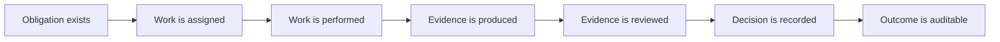

The diagram begins with an obligation rather than a task. A task is only the platform's representation of a real-world obligation. Evidence connects the digital record to the physical or financial world. Review converts evidence into an accountable decision. Auditability makes that decision defensible later.

### 2.2 What ProofFlow sells

ProofFlow does not merely sell task tracking. It sells reduced uncertainty:

- Managers know which obligations are truly complete.
- Contributors know exactly what proof is expected before doing the work.
- Auditors can verify evidence without reconstructing history from email and chat.
- Organizations can demonstrate control effectiveness to clients, funders, regulators, or management.
- Finance and procurement teams can link spend to approved work and supporting documents.

### 2.3 Design axioms

Every product and technical decision should follow these axioms:

1. **A completion claim and a verified outcome are different facts.** The data model must never collapse them into one boolean.
2. **Evidence is contextual.** A photo may prove installation but not payment; requirements must describe what each item proves.
3. **Rules must be reproducible.** A future auditor must see the rule version used at the time, even if rules later change.
4. **Review is a decision by an accountable actor.** Store reviewer, decision, reason, timestamp, and reviewed evidence revision.
5. **History is append-oriented.** Corrections create new versions or events; they do not erase prior submissions and decisions.
6. **Authorization is part of correctness.** A valid-looking approval from an unauthorized person is invalid.
7. **Tenant isolation is non-negotiable.** One organization must never read or mutate another organization's data.
8. **Derived metrics are explanations, not magic numbers.** A compliance score must disclose its formula and inputs.
9. **The simplest operational design that preserves these truths wins.** Start with a modular monolith and evolve only from measured pressure.

### 2.4 Business success measures

The useful measures are not only signups or task counts. ProofFlow should track:

| Measure | Business meaning |
| --- | --- |
| Evidence-first-pass approval rate | How clearly requirements are defined and understood. |
| Median submission-to-review time | How quickly verification bottlenecks are cleared. |
| Rejection-to-resubmission time | How quickly contributors recover from a failed review. |
| Verified-on-time rate | Whether obligations are completed and proven before deadlines. |
| Evidence coverage | Portion of required evidence items satisfied by accepted evidence. |
| Overdue unverified exposure | Work claimed or underway but not verified after its due date. |
| Audit retrieval time | How quickly a defensible record can be produced. |
| Rule exception rate | How often staff bypass or override policy, with authorization. |

## 3. Actors, Tenancy, and Authority

### 3.1 Tenant model

An **Organization** is the primary security and data-ownership boundary. A user may belong to multiple organizations through `OrganizationMember`, with a different role in each. Projects, tasks, evidence, rules, reports, and audit logs belong to exactly one organization, either directly or through a parent.

Never infer the active organization only from a URL parameter. Resolve membership from the authenticated user and verify every requested resource belongs to that same organization.

### 3.2 Primary roles

| Capability | Admin | Manager | Contributor | Auditor |
| --- | :---: | :---: | :---: | :---: |
| Manage organization and members | Yes | No | No | No |
| Define and publish rules | Yes | Optional | No | Read |
| Create projects and milestones | Yes | Yes | No | Read |
| Create and assign tasks | Yes | Yes | No | Read |
| Perform assigned work | Optional | Optional | Yes | No |
| Submit evidence for assigned work | Optional | Optional | Yes | No |
| Review evidence | Optional | Optional by policy | No | Yes |
| View audit records | Yes | Project scope | Own/project scope | Yes |
| Generate compliance reports | Yes | Project scope | No | Yes |

Roles are a coarse baseline, not the entire authorization model. Resource scope matters: a Manager of Project A does not automatically control Project B, and a Contributor should only submit for tasks they are permitted to work on. High-value approvals can require separation of duties, preventing a submitter from approving their own evidence.

### 3.3 Authority decision

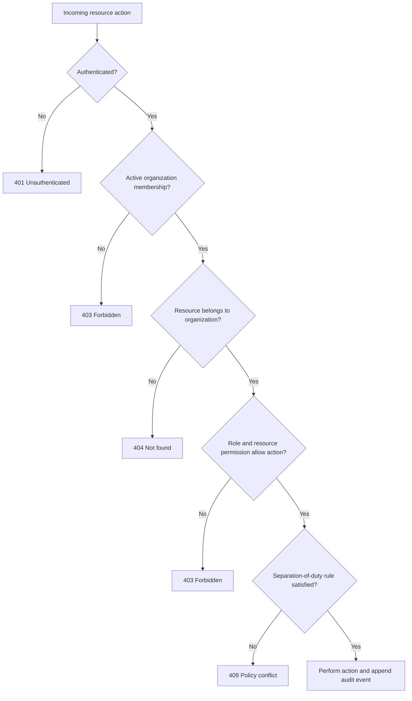

Returning `404` for a cross-tenant resource avoids confirming that another tenant's identifier exists. `409` is appropriate when identity and permission are valid but a business policy, such as self-approval prohibition, blocks the transition.

## 4. Core Business Lifecycle

### 4.1 Task lifecycle

Use a state machine rather than accepting arbitrary status updates from the client.

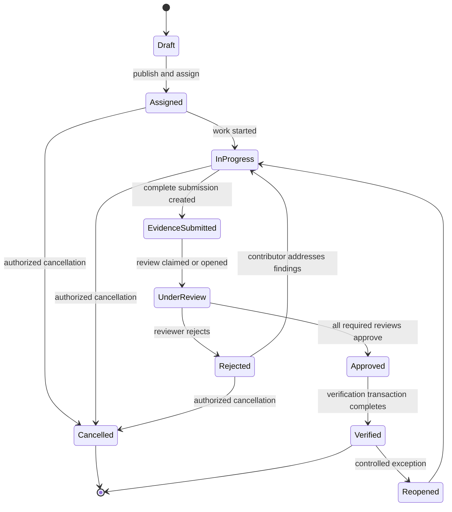

Important distinctions:

- `EvidenceSubmitted` means the contributor asserts the submission is ready. It does not mean the evidence is accepted.
- `UnderReview` signals responsibility has moved to reviewers.
- `Approved` means required approval decisions exist. `Verified` means the whole verification transaction succeeded and the durable audit/notification consequences were recorded.
- `Rejected` is not deletion. It is a review outcome pointing to a preserved submission revision.
- Reopening verified work is exceptional and must require permission and a reason.

### 4.2 Invariants

A transition is legal only if all relevant invariants hold:

- A task cannot be assigned without an eligible organization/project member.
- A task cannot be submitted if blocking dependencies are unverified.
- A submission cannot be declared complete if a mandatory evidence requirement has no evidence item.
- A reviewer cannot decide a submission outside their authorized scope.
- Self-review is forbidden when the applicable policy requires separation of duties.
- A rejection requires a non-empty, actionable reason.
- Verification requires all mandatory evidence requirements and approval stages to be satisfied.
- A verified task cannot be silently edited in a way that changes its proof obligations.
- Every state transition produces an audit event in the same database transaction.

### 4.3 Evidence submission and review

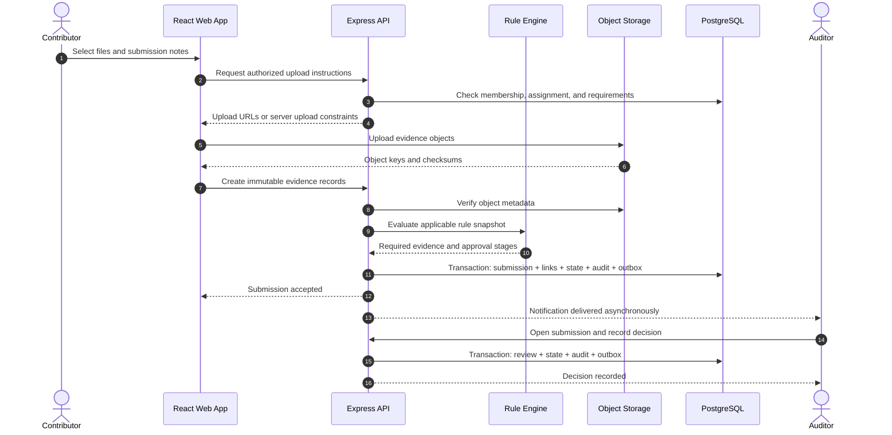

The browser uploads large objects directly to object storage when possible, preventing the API from becoming a file-transfer bottleneck. The API remains authoritative: it authorizes the upload, verifies the resulting object metadata, links it to an immutable evidence record, evaluates rules, and commits the workflow change.

### 4.4 Rejection and resubmission

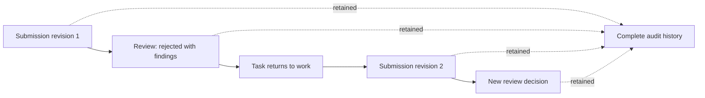

Revision 2 may reuse still-valid evidence from revision 1 and add replacements. The submission is the reviewed bundle; evidence items are the underlying immutable artifacts. This makes it clear exactly what the auditor saw for each decision.

## 5. Business Capability Map

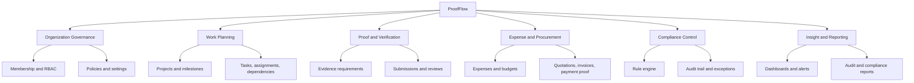

Capabilities describe what the business needs independently of code. The module design below follows these boundaries so that product language, database ownership, APIs, and team conversations align.

## 6. System Context

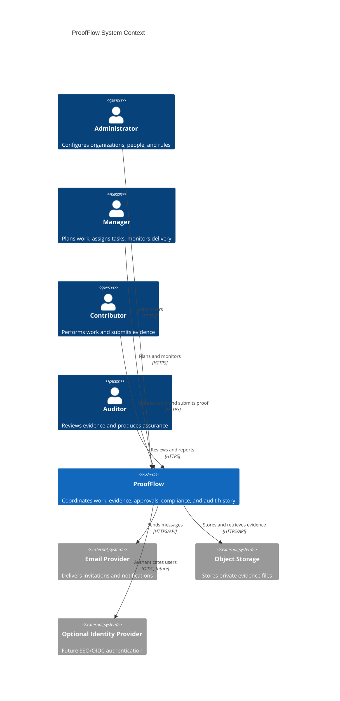

ProofFlow is the system of record for workflow and decisions, while object storage is the system of record for file bytes. An email provider is a delivery channel, never the source of truth for notification status or approval decisions.

## 7. Container Architecture

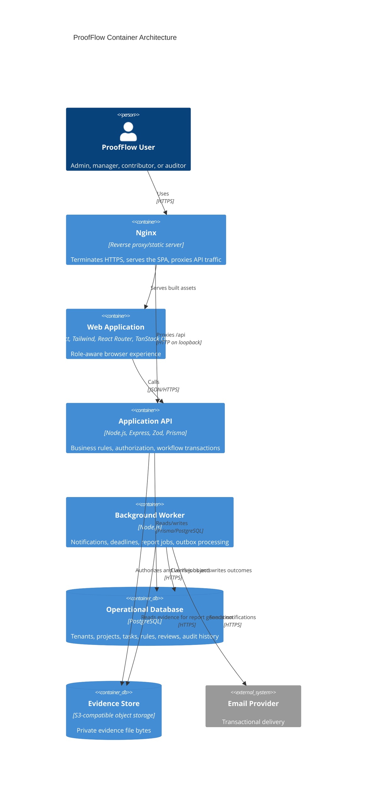

Initially the API and worker can come from the same codebase and share domain services, but run as separate processes. The worker makes slow or retryable activities independent from user request latency.

## 8. Architecture Style and Module Boundaries

### 8.1 Why a modular monolith

ProofFlow has complex consistency rules but does not initially have demonstrated scale requiring distributed services. A modular monolith provides:

- one transaction boundary for workflow state, reviews, audit events, and outbox messages;
- simple local development and EC2 deployment;
- fewer network failure modes;
- clear business modules that can be extracted later;
- enough architectural depth for a major project without operational theatre.

Microservices should appear only when there is measured independent scaling, ownership, security isolation, or availability pressure. File processing and reporting are the most likely early extraction candidates because they are compute-heavy and asynchronous.

### 8.2 Bounded contexts

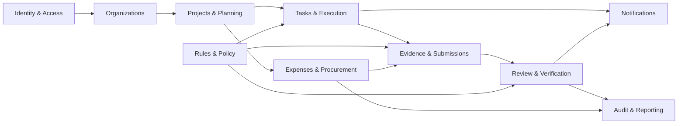

Module responsibilities:

| Module | Owns | Does not own |
| --- | --- | --- |
| Identity & Access | credentials, sessions, refresh-token families | organization role truth |
| Organizations | organizations, memberships, invitations, tenant settings | project assignments |
| Projects & Planning | projects, milestones, project membership, budgets | task evidence |
| Tasks & Execution | tasks, assignments, dependencies, task transitions | review decisions |
| Evidence & Submissions | requirements, evidence metadata, evidence bundles/revisions | approval policy definition |
| Review & Verification | review stages, decisions, verification outcome | file bytes |
| Rules & Policy | versioned rules, conditions, actions, evaluation snapshots | arbitrary application code execution |
| Expenses & Procurement | expenses, vendors/quotations, budget impacts | accounting ledger replacement |
| Notifications | in-app notification state and delivery attempts | business truth |
| Audit & Reporting | append-only business events, projections, reports | mutation of source records |

Modules may call public application services of another module. They should not reach directly into another module's repository and mutate its tables.

## 9. Backend Component Architecture

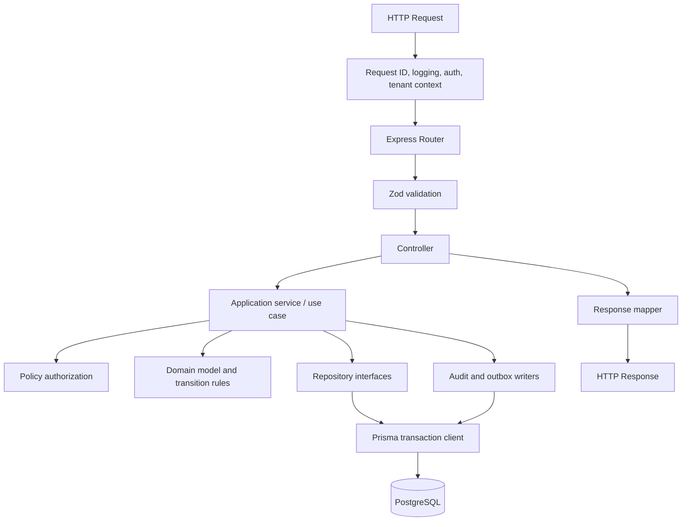

- Middleware establishes request identity and organization context but does not decide resource-specific authorization.
- Zod rejects malformed input at the boundary.
- Controllers translate HTTP into use-case calls; they contain no business workflow.
- Application services coordinate a complete use case and transaction.
- Domain functions enforce legal states and compute decisions without depending on Express.
- Repositories isolate query details and make tenant scoping explicit.
- Response mappers prevent accidental leakage of internal fields.

### 9.1 Transaction pattern

For a meaningful state change, one PostgreSQL transaction should write:

1. the new business record or state;
2. the immutable audit event;
3. an outbox message for asynchronous consequences.

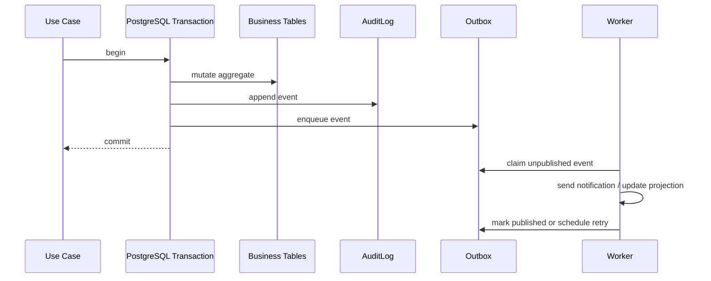

The outbox prevents the database from committing a workflow change while a corresponding notification is silently lost. Notification delivery can fail and retry without rolling back the user's valid business action.

## 10. Domain Data Model

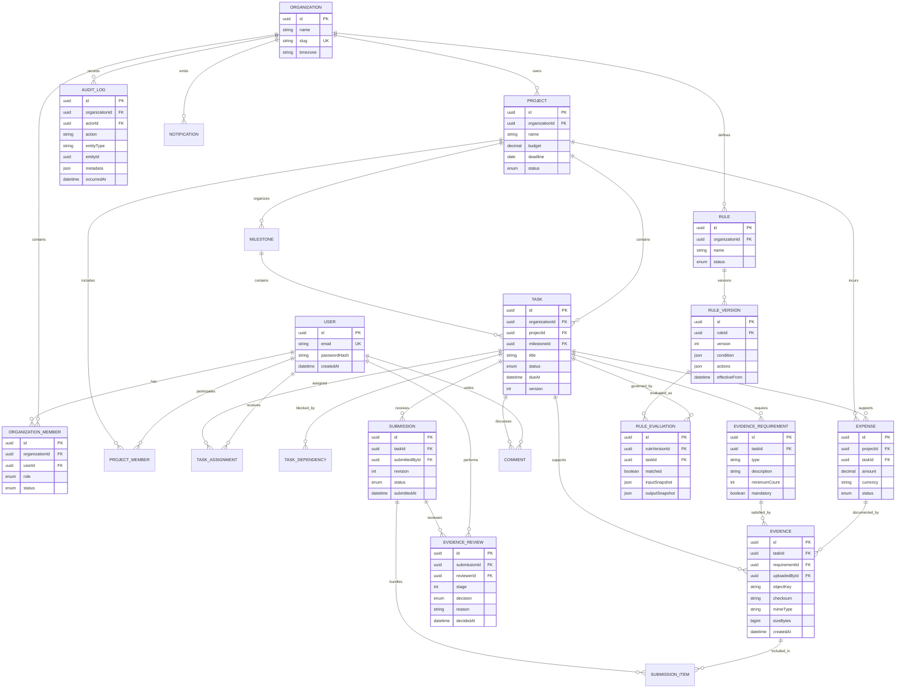

This diagram is conceptual; the Prisma schema may add technical fields and junction tables. `organizationId` should be duplicated on high-traffic tenant-owned tables such as `Task`, even when derivable through `Project`, to make tenant filtering and composite indexes reliable. Database constraints should enforce uniqueness such as one membership per user and organization, unique submission revision per task, and unique published rule version number.

### 10.1 Aggregate boundaries

An aggregate is the consistency boundary for a business change:

- **Task aggregate:** task, assignments, dependencies, requirements, and current workflow status.
- **Submission aggregate:** one revision, its evidence-item links, and its review stages.
- **Rule aggregate:** rule identity and immutable versions.
- **Expense aggregate:** amount, currency, status, and evidence/approval linkage.

Avoid loading an entire project graph for one task transition. Lock or version the smallest relevant aggregate. Use optimistic concurrency (`version` column) so two reviewers or editors cannot unknowingly overwrite each other.

## 11. Rule Engine

### 11.1 Business purpose

The rule engine turns policy from informal text into repeatable requirements. It answers: **given these facts, what evidence and approvals are required?**

It is not a general scripting platform. In the first version, rules use a constrained JSON structure with allow-listed fields and operators. This is easier to validate, explain, secure, and reproduce.

### 11.2 Rule lifecycle

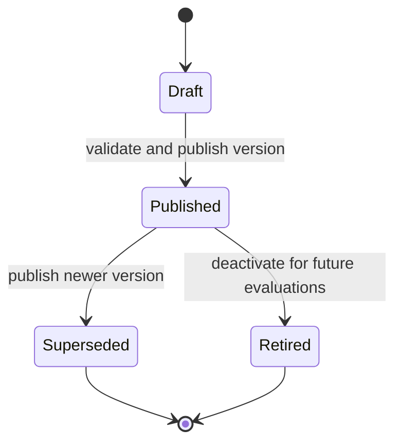

Published versions are immutable. Editing a published rule creates a new draft/version. Existing tasks retain their recorded evaluation snapshots unless an authorized user explicitly re-evaluates them, in which case both evaluations remain visible.

### 11.3 Evaluation flow

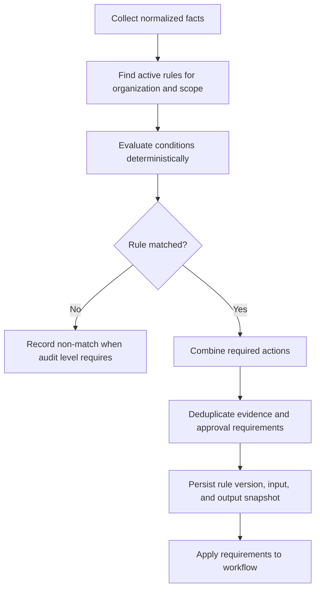

Example normalized facts:

```json
{
  "task": { "category": "PROCUREMENT", "projectId": "..." },
  "expense": { "amountMinor": 7500000, "currency": "INR" },
  "organization": { "country": "IN" }
}
```

Money is compared in minor units or a precise decimal type, never JavaScript floating-point arithmetic.

Example rule:

```json
{
  "all": [
    { "field": "task.category", "operator": "eq", "value": "PROCUREMENT" },
    { "field": "expense.amountMinor", "operator": "gt", "value": 5000000 }
  ],
  "actions": [
    { "type": "requireEvidence", "evidenceType": "QUOTATION", "minimumCount": 3 },
    { "type": "requireEvidence", "evidenceType": "INVOICE", "minimumCount": 1 },
    { "type": "requireApproval", "role": "MANAGER", "stage": 1 },
    { "type": "requireApproval", "role": "AUDITOR", "stage": 2 }
  ]
}
```

### 11.4 Conflict semantics

Rules accumulate stricter requirements by default:

- counts use the maximum required count;
- mandatory overrides optional;
- approval stages are combined in stage order;
- an explicit, authorized exception is a separate record, never an invisible weakening of a rule;
- conflicting actions that cannot be merged block publication and report a validation error.

Every evaluated requirement should be explainable as: "required because Rule X, version Y matched facts Z."

## 12. Dependency and Completion Semantics

Task dependencies form a directed acyclic graph within a project. A task may start or submit only when its dependency policy is satisfied.

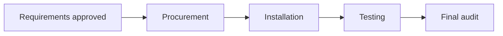

Creating a dependency must check for cycles. Deleting or cancelling a predecessor must surface affected successors. Project progress should normally be based on weighted verified work, not simply tasks marked done:

```text
project completion % = sum(weight of verified tasks) / sum(weight of active tasks) * 100
```

If no explicit weight is configured, use equal weights and label the calculation accordingly.

## 13. Frontend Architecture

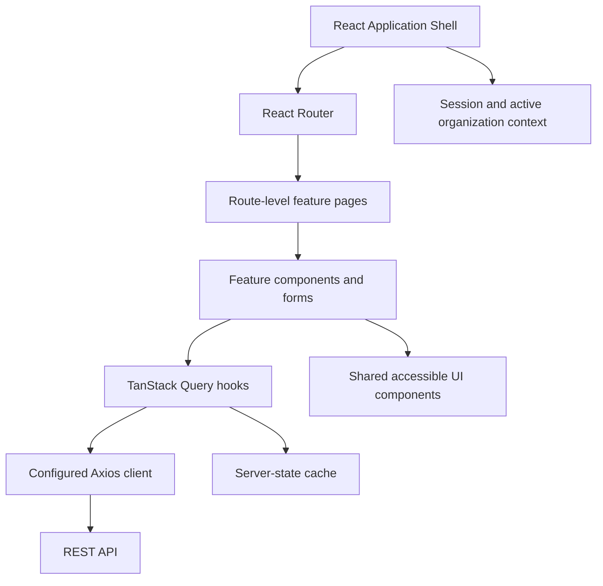

TanStack Query owns server state: projects, tasks, reviews, metrics, and notifications. Local React state owns transient interface state such as open dialogs or draft filters. Do not duplicate server data into a global client store without a demonstrated need.

Recommended route structure:

```text
/login
/organizations/:orgSlug/dashboard
/organizations/:orgSlug/projects
/organizations/:orgSlug/projects/:projectId
/organizations/:orgSlug/tasks/:taskId
/organizations/:orgSlug/reviews
/organizations/:orgSlug/rules
/organizations/:orgSlug/reports
/organizations/:orgSlug/settings/members
```

The interface should display why an action is unavailable. For example, a disabled Submit button should say that two mandatory evidence items are missing or a dependency is unverified. The UI improves understanding, but the API remains authoritative for every rule and permission.

### 13.1 Role-centered experiences

- **Admin dashboard:** member access, rule health, exceptions, organization-wide compliance.
- **Manager dashboard:** project status, blockers, overdue work, budget, pending approvals.
- **Contributor dashboard:** assigned work, due dates, missing evidence, rejection findings.
- **Auditor queue:** submissions ordered by risk, due date, age, amount, and review stage.

## 14. API Design

Use versioned REST resources under `/api/v1`. JSON field names use camelCase. Timestamps use ISO 8601 UTC; presentation uses the organization timezone. Money uses amount plus ISO currency and is serialized without lossy floating-point conversion.

Representative endpoints:

```text
POST   /api/v1/auth/login
POST   /api/v1/auth/refresh
POST   /api/v1/auth/logout
GET    /api/v1/organizations/:organizationId/projects
POST   /api/v1/organizations/:organizationId/projects
GET    /api/v1/projects/:projectId/tasks
POST   /api/v1/projects/:projectId/tasks
POST   /api/v1/tasks/:taskId/transitions
POST   /api/v1/tasks/:taskId/upload-authorizations
POST   /api/v1/tasks/:taskId/evidence
POST   /api/v1/tasks/:taskId/submissions
POST   /api/v1/submissions/:submissionId/reviews
GET    /api/v1/reviews/queue
POST   /api/v1/organizations/:organizationId/rules
POST   /api/v1/rules/:ruleId/versions/:version/publish
GET    /api/v1/projects/:projectId/dashboard
POST   /api/v1/projects/:projectId/reports
```

Use action/transition endpoints when a business command has richer meaning than generic CRUD. `POST /tasks/:id/transitions` can validate the requested target state, current version, reason, and business prerequisites. Direct `PATCH status=VERIFIED` must not exist.

### 14.1 Error contract

```json
{
  "error": {
    "code": "EVIDENCE_REQUIREMENTS_NOT_MET",
    "message": "The submission is missing mandatory evidence.",
    "details": [
      { "requirementId": "...", "missingCount": 2, "type": "QUOTATION" }
    ],
    "requestId": "..."
  }
}
```

Use stable machine-readable codes, safe human-readable messages, structured field/details data, and a request ID. Never return stack traces, Prisma internals, credentials, object keys not intended for the caller, or cross-tenant existence clues.

### 14.2 Pagination and filtering

Use cursor pagination for activity feeds, audit logs, notifications, and large review queues. Support allow-listed filters and sort fields. Enforce maximum page sizes. Search should initially use indexed PostgreSQL queries/full-text search; add a separate search engine only after measured need.

## 15. Authentication and Session Security

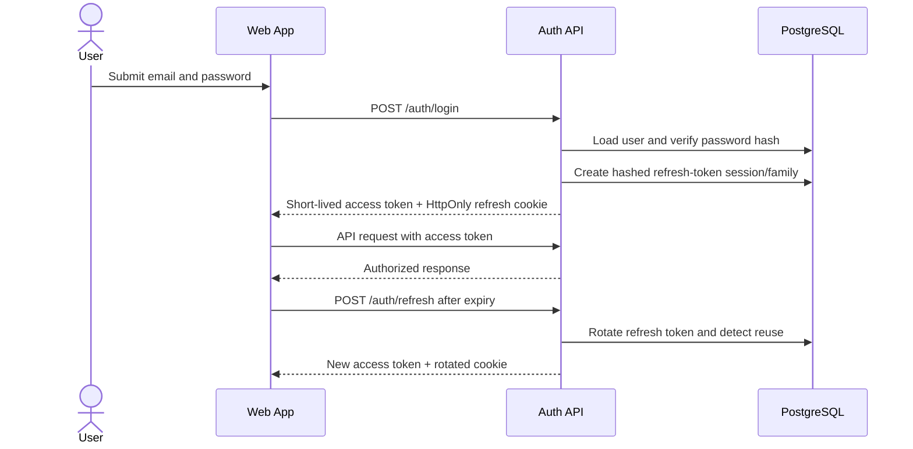

Security requirements:

- Hash passwords with argon2id or bcrypt using an appropriate work factor.
- Keep access tokens short-lived.
- Store refresh tokens only as hashes in the database and rotate them on use.
- Revoke a token family if reuse of an old refresh token is detected.
- Put refresh tokens in `HttpOnly`, `Secure` cookies with an appropriate `SameSite` policy.
- Apply CSRF protection if cookie authentication authorizes state-changing requests.
- Rate-limit login, refresh, invitation, and upload-authorization endpoints.
- Require recent authentication for sensitive changes such as role promotion or security settings.
- Record security-relevant events without recording tokens or passwords.

## 16. Evidence Storage and Safety

PostgreSQL stores evidence metadata; private S3-compatible object storage stores file bytes. For a small initial deployment, local disk can be a development-only adapter, but production should not depend on an EC2 instance's local filesystem for durable evidence.

Evidence upload lifecycle:

1. API verifies membership, assignment, file policy, and expected requirement.
2. API issues a short-lived, size/type-restricted upload authorization.
3. Browser uploads the object.
4. API verifies key, size, content type, and checksum before creating an evidence record.
5. Optional malware scanning moves the object from quarantine to accepted status.
6. Downloads use short-lived signed URLs after authorization.

Object keys should be opaque and tenant-partitioned. Original filenames are untrusted display metadata. Prevent executable content from being served inline on the application origin. Define retention/legal-hold rules before allowing permanent deletion.

## 17. Audit Architecture

An audit log answers: who performed what action, on which entity, for which organization, when, from which request, and with what meaningful change.

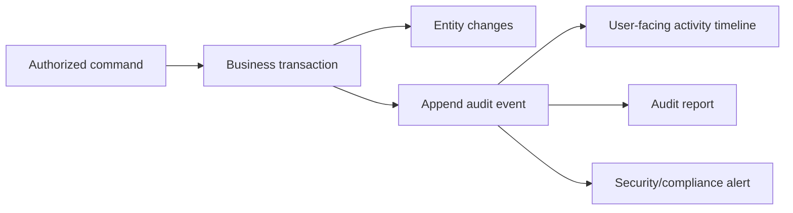

Audit events should contain:

- actor user and membership/role context;
- organization and optional project scope;
- action and entity type/id;
- timestamp generated by the server;
- request/correlation ID;
- safe before/after values or a domain-specific change summary;
- reason for privileged, rejected, cancelled, reopened, or exception actions;
- relevant rule and submission revisions.

Audit rows are append-only at the application level. Database access to mutate them should be restricted. Avoid putting file contents or highly sensitive secrets in audit metadata. If stronger tamper evidence becomes necessary, periodically hash-chain/export signed audit batches to immutable storage.

## 18. Notifications and Scheduled Work

Notifications are consequences of business events, not business decisions themselves.

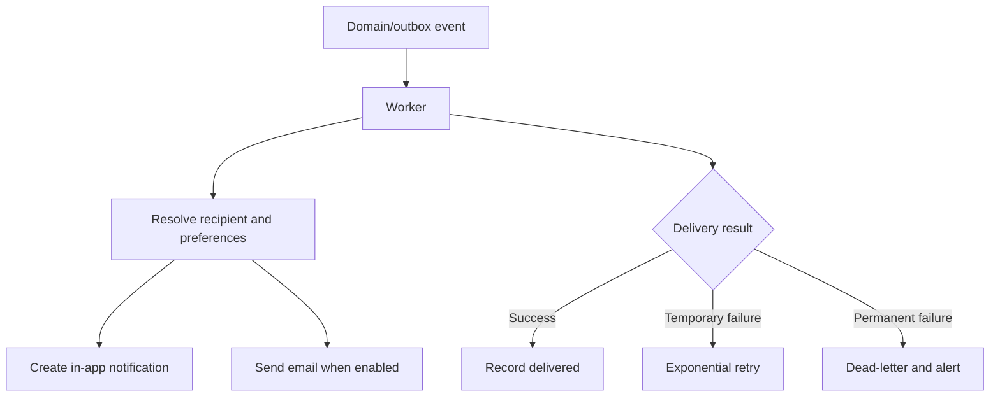

Scheduled jobs include upcoming deadline reminders, overdue transitions/alerts, report generation, expired invitation cleanup, and upload quarantine cleanup. Jobs must be idempotent: retrying the same job must not create duplicate approvals, audit records, or user-visible messages. Use database-backed jobs initially; add Redis/managed queues only when operational needs justify them.

## 19. Analytics and Compliance Semantics

Dashboards are derived projections, never alternative sources of truth. Initial metrics can be computed with indexed SQL and cached briefly. Expensive reports should run asynchronously against a consistent snapshot.

Suggested transparent formulas:

```text
Evidence coverage = accepted mandatory evidence slots / total mandatory evidence slots

Approval completion = completed required approval stages / total required approval stages

On-time verification = tasks verified by due date / tasks due in period

Compliance score = weighted average of evidence coverage,
                   approval completion,
                   on-time verification,
                   and unresolved exception penalty
```

The chosen weights, period, exclusions, and last-computed time must be visible. A score without an explanation can create false confidence.

## 20. Production Deployment on AWS EC2

### 20.1 Deployment topology

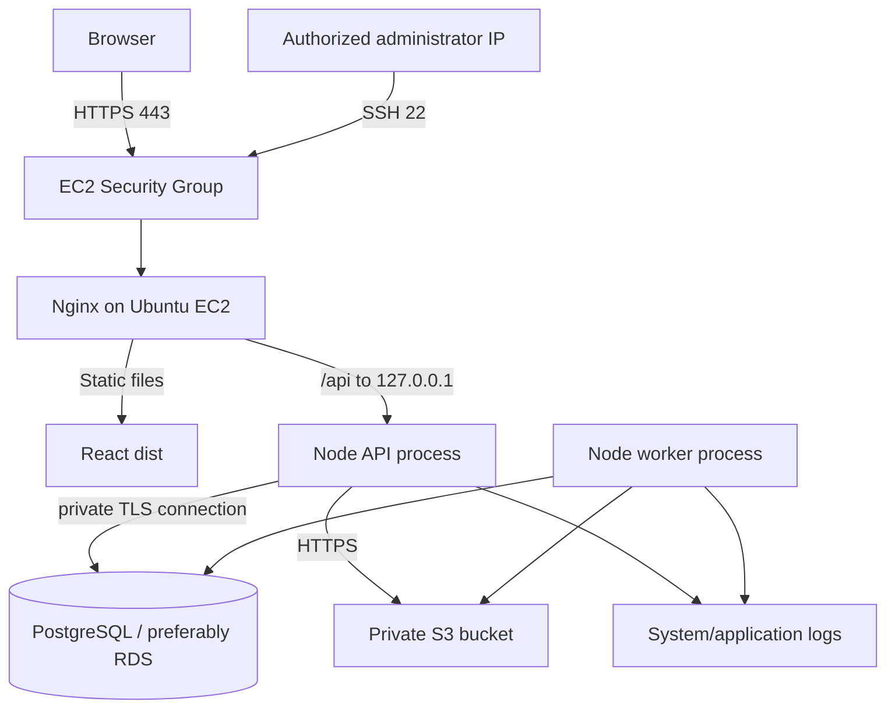

Only ports 80/443 are public. Port 22 is restricted to the authorized IP. The Node API listens on loopback and is not exposed by the security group. PostgreSQL should preferably run on RDS in private networking; if PostgreSQL is temporarily colocated on EC2, it must also listen privately and have verified backups.

Operational SSH reference:

```bash
ssh -i "proofflow.pem" ubuntu@ec2-13-218-222-35.compute-1.amazonaws.com
```

The PEM file is a credential: never commit it, print it, copy its contents into documentation, or upload it to the server unnecessarily.

### 20.2 Nginx request flow

```mermaid
sequenceDiagram
    participant B as Browser
    participant N as Nginx
    participant F as React dist
    participant A as Express API

    B->>N: GET /projects/123
    N->>F: Try static file, then /index.html
    F-->>B: SPA shell and assets
    B->>N: GET /api/v1/projects/123
    N->>A: Proxy to 127.0.0.1:3000
    A-->>N: JSON response
    N-->>B: JSON response over HTTPS
```

Nginx responsibilities:

- terminate TLS and redirect HTTP to HTTPS;
- serve versioned static assets with long cache lifetimes;
- serve `index.html` with no/short caching so deployments take effect;
- fall back to `index.html` for React Router routes;
- proxy `/api/` and forward `Host`, `X-Forwarded-For`, `X-Forwarded-Proto`, and a request ID;
- set appropriate request-body limits and timeouts;
- support WebSocket upgrade headers only if realtime is enabled;
- apply baseline security headers without breaking the application.

Express must trust only the known proxy hop so secure cookies and client IP handling are correct.

### 20.3 Server layout and processes

Suggested layout:

```text
/srv/proofflow/
  releases/<release-id>/
  current -> releases/<release-id>/
  shared/
    env/api.env
    logs/                 # only if not using journald
```

Use systemd units for `proofflow-api` and `proofflow-worker`, with automatic restart, a dedicated unprivileged user, explicit environment files, memory limits, and journald logging. PM2 is acceptable, but systemd reduces the number of operational layers on a single Ubuntu host.

### 20.4 Deployment sequence

```mermaid
flowchart LR
    C[Commit] --> CI[Lint, test, build]
    CI --> ART[Versioned release artifact]
    ART --> UP[Upload to new release directory]
    UP --> MIG[Run backward-compatible Prisma migrations]
    MIG --> START[Install/start API and worker]
    START --> HEALTH[Health and smoke checks]
    HEALTH --> SWITCH[Switch current release and reload Nginx]
    SWITCH --> VERIFY[Production verification]
```

Database migration compatibility determines rollback safety. Prefer expand-and-contract migrations: add compatible fields/tables first, deploy code that supports both shapes, backfill, then remove obsolete structures in a later release.

## 21. Configuration and Secrets

Configuration is environment-specific; business rules belong in the database. Commit only a redacted `.env.example`.

Expected production settings include:

```text
NODE_ENV
PORT
APP_ORIGIN
DATABASE_URL
JWT_ACCESS_SECRET or asymmetric key references
REFRESH_TOKEN_SECRET
S3_BUCKET
S3_REGION
S3_ENDPOINT (only for compatible providers)
AWS credential provider configuration
EMAIL provider configuration
LOG_LEVEL
```

Prefer an EC2 IAM role for S3 rather than long-lived AWS access keys. Restrict the application to its bucket/prefix and required actions. Secrets should live in a root-readable environment file, AWS Systems Manager Parameter Store, or Secrets Manager—not source control.

## 22. Reliability, Recovery, and Observability

### 22.1 Health model

- `/health/live`: process event loop is responsive; no external dependencies.
- `/health/ready`: API can reach required dependencies and is ready for traffic.
- Background worker heartbeat: last successful job claim/processing time.

Do not expose dependency credentials, stack traces, or detailed infrastructure topology from public health endpoints.

### 22.2 Logs, metrics, and traces

Use structured JSON logs in production with timestamp, level, service, request ID, organization ID where safe, actor ID where safe, route template, status, duration, and error code. Never log passwords, tokens, raw cookies, private evidence URLs, or full sensitive document metadata.

Important metrics:

- HTTP request rate, errors, and latency;
- database pool use and slow queries;
- evidence upload authorization/finalization failures;
- outbox backlog and oldest event age;
- job attempts, failures, and dead letters;
- submissions awaiting review by age;
- notification delivery failure rate;
- disk, memory, CPU, certificate expiry, and instance availability.

Request IDs should flow from Nginx through API logs, audit events, worker jobs, and provider calls.

### 22.3 Backup and disaster recovery

- Enable automated PostgreSQL backups and point-in-time recovery where available.
- Enable S3 versioning and appropriate lifecycle/retention rules.
- Encrypt database and object storage at rest and use TLS in transit.
- Test restoration, not merely backup creation.
- Document recovery time objective (RTO) and recovery point objective (RPO).
- Keep infrastructure configuration and deployment procedures reproducible.

For an early production system, a reasonable target might be a 24-hour RTO and 1-hour RPO, but the business owner must explicitly approve targets based on evidence criticality.

## 23. Performance and Scaling Path

Design for correctness first, then measure.

### Stage 1: single application host

- Nginx, API, and worker on one EC2 instance;
- PostgreSQL on RDS if possible;
- evidence in S3;
- database-backed outbox/jobs;
- indexed SQL analytics.

### Stage 2: remove single-host pressure

- build immutable application artifacts or containers;
- place multiple stateless API instances behind an Application Load Balancer;
- run workers independently;
- use managed Redis/queue only for demonstrated queue/cache requirements;
- move report generation/file scanning to dedicated workers.

### Stage 3: specialized data paths

- read replicas or analytics store for heavy reporting;
- search service for cross-document/full-text scale;
- CDN for public static assets;
- separate evidence-processing service if throughput or security isolation demands it.

```mermaid
flowchart LR
    S1[Single EC2 modular monolith] -->|measured request pressure| S2[Multiple stateless API instances]
    S1 -->|slow background work| W[Dedicated workers]
    S2 -->|reporting load| A[Analytics/read model]
    S2 -->|search load| SE[Search service]
    W -->|file throughput or isolation| FP[Evidence processing service]
```

The arrows represent evidence-based extraction triggers, not a predetermined march toward microservices.

## 24. Testing Strategy

```mermaid
flowchart TB
    E2E[Small end-to-end suite: critical user journeys]
    INT[Integration tests: API, PostgreSQL, object-store adapter]
    UNIT[Many unit/property tests: domain states, rules, permissions]
    UNIT --> INT --> E2E
```

Required test areas:

- state-machine transition tables, including forbidden transitions;
- tenant isolation for every resource family;
- role/resource scope and separation-of-duty policy;
- deterministic rule evaluation, combination, and version snapshots;
- evidence requirement counts, revisions, rejection, and resubmission;
- concurrent review/edit conflicts;
- audit and outbox creation in the same transaction;
- idempotent worker retry behavior;
- authentication rotation/reuse detection;
- upload type/size/ownership validation;
- budget and compliance calculations;
- Nginx SPA fallback and `/api` proxy smoke tests.

Use a real PostgreSQL test database for repository and transaction behavior; SQLite is not an adequate substitute for PostgreSQL constraints, types, locking, or Prisma behavior.

## 25. Recommended Monorepo Structure

```text
proofflow/
  apps/
    web/
      src/
        app/                 # router, providers, application shell
        features/            # projects, tasks, evidence, reviews, rules
        components/          # shared UI
        lib/                 # API client and utilities
    api/
      src/
        modules/
          auth/
          organizations/
          projects/
          tasks/
          evidence/
          reviews/
          rules/
          expenses/
          notifications/
          audit/
        platform/            # database, storage, email, logging, jobs
        http/                # Express composition, middleware, errors
        worker/              # outbox and scheduled job entry points
      prisma/
        schema.prisma
        migrations/
  packages/
    contracts/               # shared API schemas/types with browser-safe code
    config/                  # shared lint/TypeScript config
    ui/                      # optional design system after real reuse emerges
  infra/
    nginx/
    systemd/
    scripts/
  docs/
    ARCHITECTURE.md
    adr/
  .env.example
  package.json
```

Avoid turning `packages/shared` into an unbounded dumping ground. Shared packages should have a precise purpose and must never leak database models or server secrets into the web bundle.

## 26. Delivery Roadmap

### Phase 1: trustworthy task foundation

Authentication, organizations, memberships, projects, milestones, tasks, assignments, basic RBAC, audit events, and deployment skeleton.

Exit condition: two organizations can operate without data leakage, and authorized users can plan and execute tasks with a visible history.

### Phase 2: proof workflow

Evidence requirements, object upload, submission revisions, review queue, approval/rejection, resubmission, and verification state machine.

Exit condition: a full assigned-to-verified journey is defensible from the audit record.

### Phase 3: operating controls

Notifications, deadlines, comments, expenses/procurement, budgets, background worker, and operational dashboards.

Exit condition: teams can manage work daily and see bottlenecks and financial evidence.

### Phase 4: policy and assurance

Versioned rule engine, multi-stage approvals, exceptions, compliance score, and generated audit reports.

Exit condition: an organization can express a policy, prove how it was evaluated, and export an audit package.

### Phase 5: hardening and scale

SSO, malware scanning, realtime updates if useful, enhanced monitoring, restore drills, performance work, and horizontally scalable deployment.

Exit condition: improvements are driven by production risk and measurements rather than feature novelty.

## 27. Architecture Decisions

| Decision | Choice | Reason |
| --- | --- | --- |
| Application shape | Modular monolith | Preserves transactions and keeps EC2 operations manageable. |
| Primary database | PostgreSQL | Strong relations, constraints, transactions, indexing, JSON support. |
| ORM | Prisma | Type-safe schema/client and migration workflow for Node.js. |
| API | REST | Resource/action model fits workflows and is easy to operate. |
| Validation | Zod at boundaries | Shared declarative validation and safe parsing. |
| File storage | Private S3-compatible object storage | Durable, scalable bytes separated from relational metadata. |
| Async consistency | Transactional outbox | Avoids dual-write loss between DB changes and notifications/jobs. |
| Rules | Constrained, versioned JSON DSL | Deterministic, explainable, secure, and auditable. |
| Auth | Short access tokens + rotating refresh sessions | Balances API ergonomics, revocation, and browser security. |
| Deployment | Nginx + systemd on Ubuntu EC2 | Small operational footprint and clear process ownership. |
| Tenancy | Shared database/schema with mandatory organization scope | Simple initial operations; strong application/query constraints required. |

Create a short Architecture Decision Record in `docs/adr/` whenever one of these decisions changes or a significant new dependency is introduced.

## 28. Explicit Non-Goals for the First Release

- Replacing a full accounting/ERP system.
- A general-purpose no-code programming language.
- Public anonymous evidence sharing.
- Blockchain as a substitute for access control and sound audit design.
- Microservices without measured operational need.
- AI deciding compliance outcomes without accountable human policy and review.
- Arbitrarily configurable workflows that make invariants impossible to understand.

These exclusions protect the core: credible proof, authorized review, reproducible policy, and usable audit history.

## 29. Open Product Decisions

The architecture supports these choices, but product ownership must decide them before their relevant phase:

1. Can one task have multiple contributors, and may any one submit for the group?
2. Which roles may review, and when is separation of duties mandatory?
3. Does approval apply to each evidence item, a submission bundle, or both? The proposed core decision is bundle-level review with optional item findings.
4. When do rule changes re-evaluate open tasks?
5. What evidence retention, deletion, and legal-hold policies apply?
6. How is project task weight determined for progress metrics?
7. Are expense approvals part of ProofFlow or synchronized with an accounting system?
8. What compliance-score formula and weights are acceptable for each organization?
9. What RPO/RTO and evidence availability commitments does production require?
10. Which document types require malware scanning, OCR, or metadata extraction?

Until decided, implementations must preserve data and avoid irreversible assumptions.

## 30. Definition of Architectural Correctness

A ProofFlow feature is architecturally correct when:

- it expresses a real business concept in domain language;
- it enforces tenant, role, resource, and separation-of-duty authorization;
- it changes state only through legal, tested transitions;
- it preserves rule, evidence, submission, review, and actor history;
- it commits business state, audit history, and async intent consistently;
- it exposes an understandable API error when an invariant fails;
- it can be operated, observed, backed up, restored, and secured;
- it adds distributed infrastructure only when a measured need justifies it.

That definition is the thread connecting business logic to code, database design, user experience, and deployment.
