# ProofFlow Architecture Speedrun

> A compressed guide to `docs/ARCHITECTURE.md` from section 5 onward, while preserving the architectural crux.

## The crux

ProofFlow is not primarily a task manager. It turns:

```text
obligation -> work -> evidence -> review -> decision -> auditable outcome
```

Work is not truly complete because somebody clicked a checkbox. It becomes verified only when:

- required evidence exists;
- authorized reviewers approve it;
- all required workflow stages succeed; and
- the complete history is preserved.

The implementation must therefore preserve these truths:

1. Claimed completion and verified completion are different facts.
2. Evidence, submissions, reviews, rule versions, and audit events are historical records.
3. Authorization includes organization, role, resource scope, and separation of duties.
4. Business state, audit history, and asynchronous intent are committed consistently.
5. Start with a modular monolith; extract services only when measured pressure justifies it.

## 5. Business capability map

The product is organized around six business capabilities:

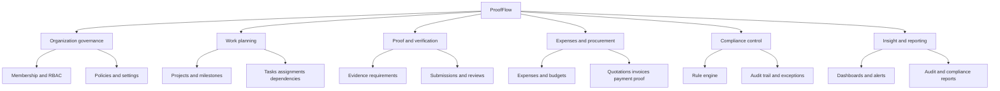

These are business boundaries first. Code modules, database ownership, APIs, and team discussions should follow them.

## 6–7. System and container architecture

ProofFlow is the source of truth for workflow and decisions. Object storage is the source of truth for file bytes. Email is only a delivery mechanism.

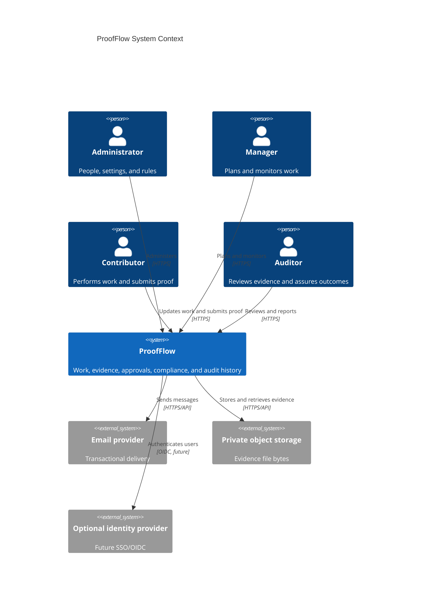

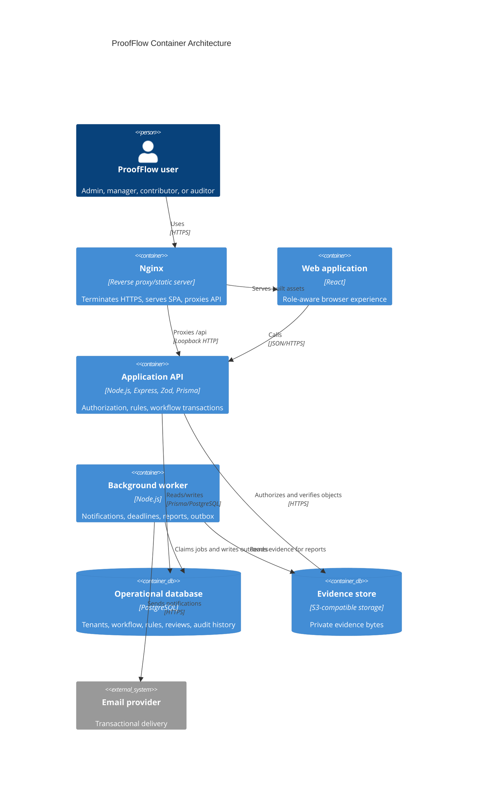

The API and worker can share a codebase but should run as separate processes so retryable or slow work does not increase request latency.

## 8. Modular monolith and module boundaries

A modular monolith is the correct first shape because ProofFlow needs strong consistency but does not yet demonstrate the scale that requires microservices.

Benefits:

- one transaction boundary for workflow, reviews, audit, and outbox records;
- simpler development and EC2 deployment;
- fewer network failure modes;
- clear modules that can later be extracted.

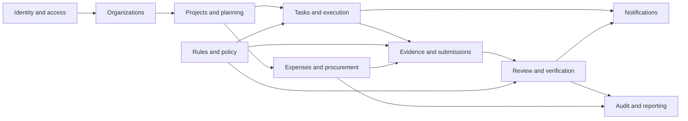

| Module | Owns | Does not own |
| --- | --- | --- |
| Identity & Access | Credentials, sessions, refresh-token families | Organization role truth |
| Organizations | Organizations, memberships, invitations, tenant settings | Project assignments |
| Projects & Planning | Projects, milestones, project members, budgets | Task evidence |
| Tasks & Execution | Tasks, assignments, dependencies, task transitions | Review decisions |
| Evidence & Submissions | Requirements, evidence metadata, bundles, revisions | Approval policy definition |
| Review & Verification | Review stages, decisions, verification outcomes | File bytes |
| Rules & Policy | Versioned rules, conditions, actions, evaluation snapshots | Arbitrary code execution |
| Expenses & Procurement | Expenses, vendors, quotations, budget impact | Full accounting ledger |
| Notifications | In-app state and delivery attempts | Business truth |
| Audit & Reporting | Append-only events, projections, reports | Source-record mutation |

Modules may call another module's public application service. They should not directly mutate another module's tables.

## 9. Backend request and transaction architecture

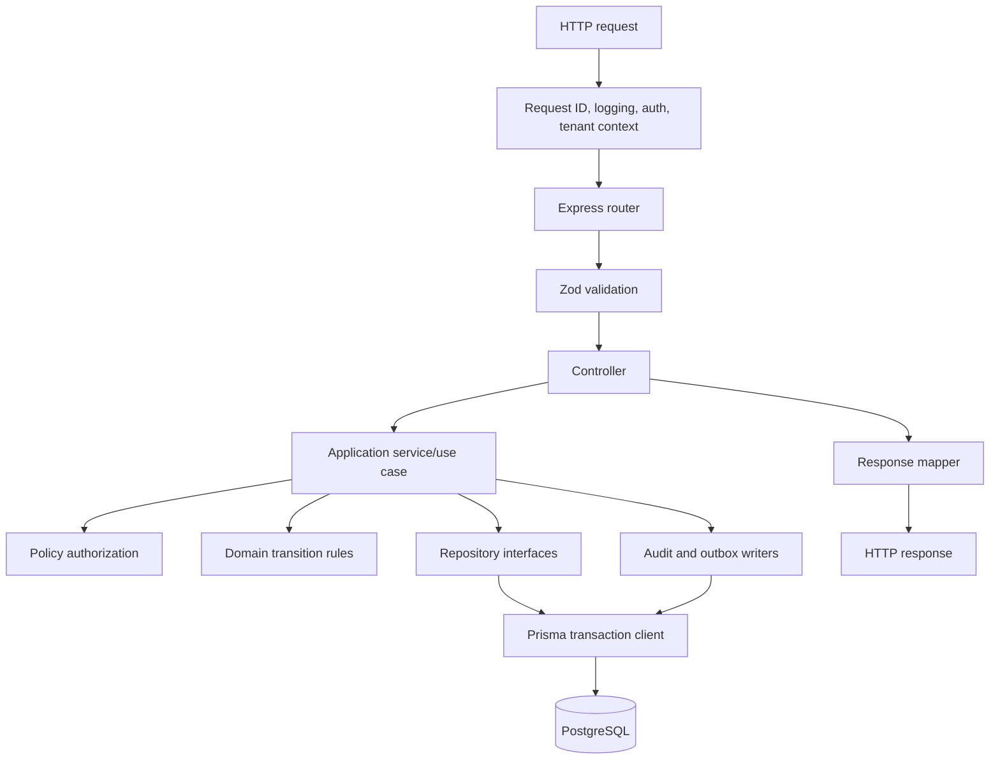

Responsibilities:

- Middleware establishes identity and organization context.
- Zod validates input at the boundary.
- Controllers translate HTTP and contain no workflow logic.
- Application services coordinate a complete use case.
- Domain functions enforce legal states without depending on Express.
- Repositories make tenant scoping explicit.
- Response mappers prevent internal-field leakage.

Every meaningful state change should use this transaction pattern:

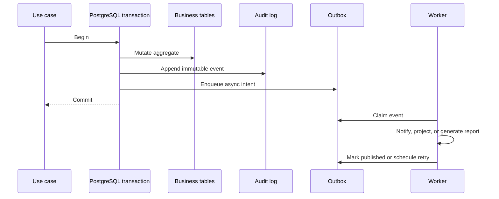

This prevents a valid business action from committing while its notification or downstream consequence is lost.

## 10. Data model and aggregate boundaries

Core records include organizations, memberships, projects, milestones, tasks, assignments, dependencies, evidence requirements, evidence files, submissions, reviews, rules, rule versions, evaluations, expenses, notifications, and audit logs.

All organization-owned records must be tenant-scoped. Duplicate `organizationId` on high-traffic records such as `Task` to make filtering and composite indexes reliable.

The main consistency boundaries are:

- **Task aggregate:** task, assignments, dependencies, requirements, and current status.
- **Submission aggregate:** one revision, linked evidence, and review stages.
- **Rule aggregate:** rule identity and immutable versions.
- **Expense aggregate:** amount, currency, status, evidence, and approvals.

Do not load or lock an entire project to transition one task. Use the smallest relevant aggregate and optimistic concurrency, such as a `version` column.

## 11. Rule engine

The rule engine answers:

> Given these facts, what evidence and approvals are required?

It is a constrained JSON DSL, not a general scripting platform. Rules use allow-listed fields and operators so they are secure, deterministic, explainable, and reproducible.

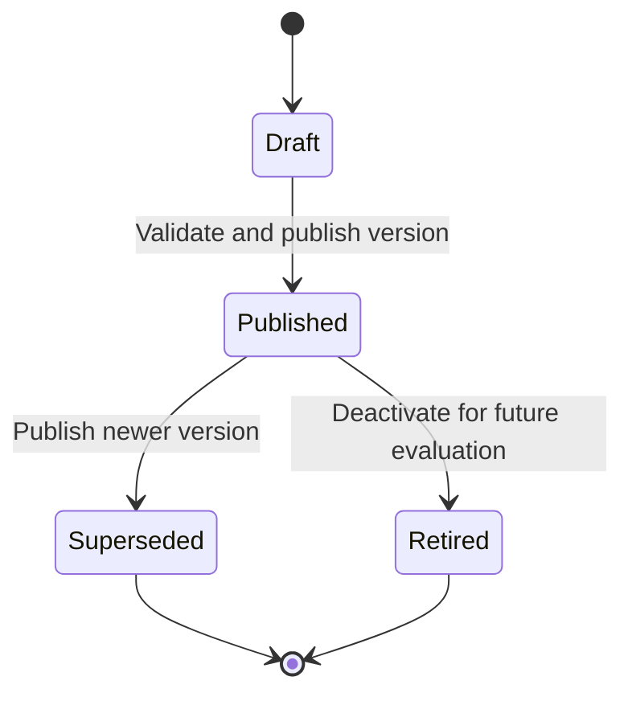

Published versions are immutable. Editing one creates a new version. Existing tasks retain their evaluation snapshots unless explicitly re-evaluated; both evaluations remain visible.

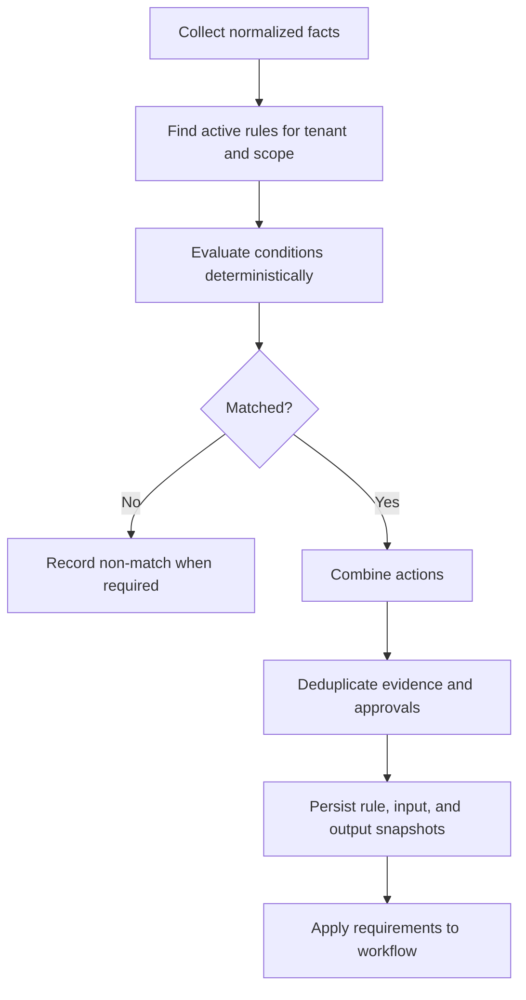

Conflict semantics:

- Evidence counts use the maximum requirement.
- Mandatory overrides optional.
- Approval stages combine in order.
- Exceptions are explicit records.
- Unmergeable conflicts block publication.
- Money comparisons use minor units or precise decimals, never floating-point arithmetic.

Every generated requirement should explain which rule version matched which facts.

## 12. Dependencies and completion

Task dependencies form a directed acyclic graph. Creating a dependency must detect cycles, and cancelling or deleting a predecessor must surface affected successors.

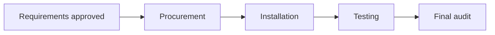

Project completion should normally be:

```text
sum(weight of verified tasks) / sum(weight of active tasks) * 100
```

If weights are not configured, use equal weights and label the calculation accordingly.

## 13. Frontend architecture

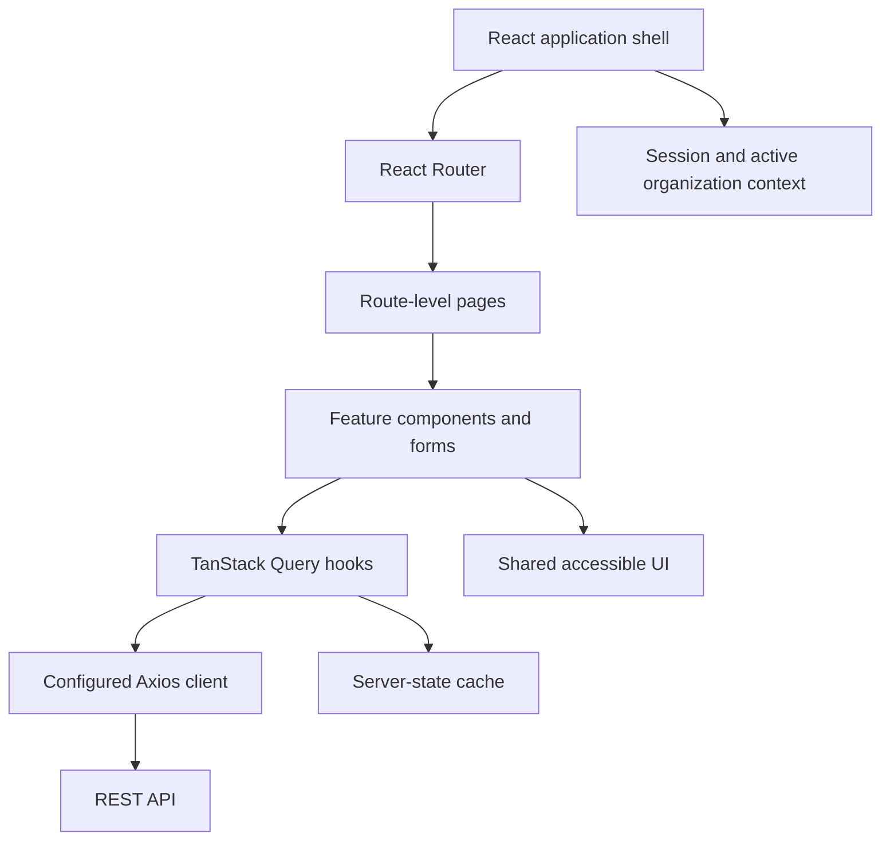

TanStack Query owns server state. Local React state owns transient interface state. Avoid duplicating server data into a global store without a demonstrated need.

The UI should explain why actions are unavailable, but the API remains authoritative. Typical role-centered experiences are:

- Admin: members, rules, exceptions, organization compliance.
- Manager: status, blockers, overdue work, budgets, approvals.
- Contributor: assignments, deadlines, missing evidence, rejection findings.
- Auditor: review queue ordered by risk, age, due date, amount, and stage.

## 14. API design

Use versioned REST resources under `/api/v1`, camelCase JSON, ISO 8601 UTC timestamps, organization-timezone presentation, and lossless money serialization.

Use action endpoints for business commands:

```text
POST /api/v1/tasks/:taskId/transitions
POST /api/v1/tasks/:taskId/submissions
POST /api/v1/submissions/:submissionId/reviews
POST /api/v1/rules/:ruleId/versions/:version/publish
```

Do not expose generic status mutation such as `PATCH status=VERIFIED`. A transition command must validate target state, current version, reason, permissions, and prerequisites.

Errors should contain a stable code, safe message, structured details, and request ID. Never expose stack traces, ORM internals, secrets, private object keys, or cross-tenant existence clues.

Use cursor pagination for audit logs, activity feeds, notifications, and large review queues. Filters and sort fields must be allow-listed.

## 15. Authentication and session security

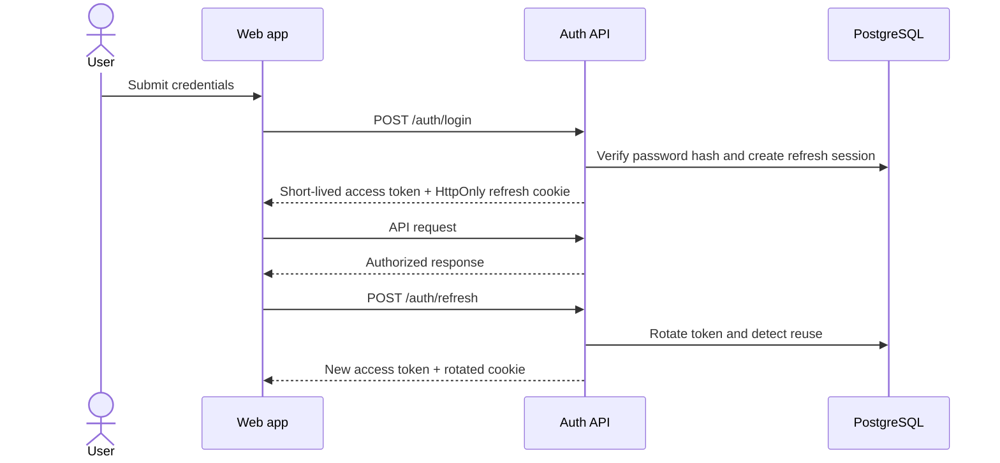

Use Argon2id or bcrypt, short-lived access tokens, hashed refresh tokens, refresh-family revocation on reuse, secure cookies, CSRF protection where needed, rate limiting, and recent authentication for sensitive security changes.

## 16. Evidence storage and safety

PostgreSQL stores evidence metadata; private S3-compatible storage stores file bytes. Local disk is acceptable only as a development adapter.

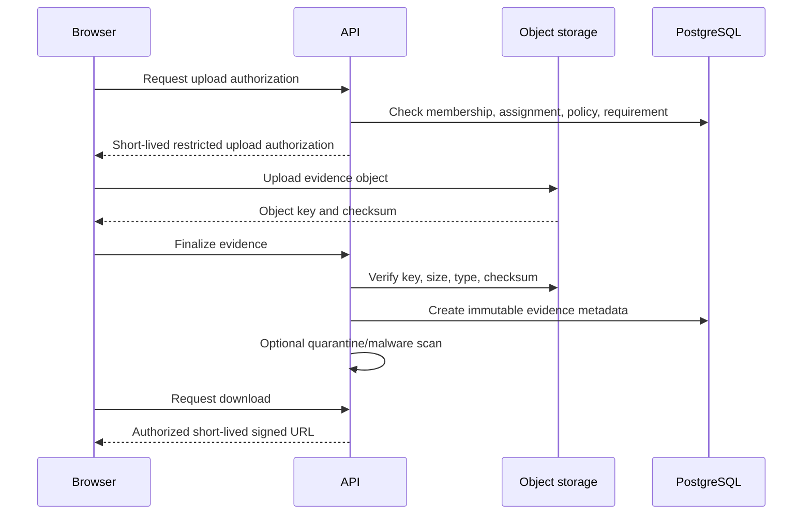

Object keys should be opaque and tenant-partitioned. Filenames are untrusted display metadata. Define retention and legal-hold rules before permanent deletion.

## 17. Audit architecture

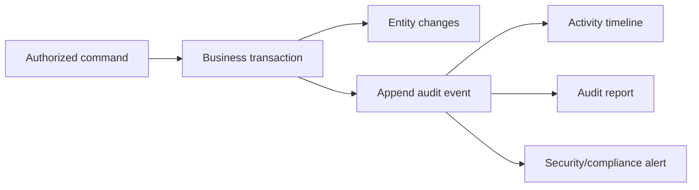

An audit event should capture actor and role context, organization/project scope, action, entity, server timestamp, request ID, meaningful before/after data, reasons, rule version, and submission revision.

Audit rows are append-only. Keep secrets and file contents out of metadata. If stronger tamper evidence is needed later, use signed or hash-chained audit exports.

## 18. Notifications and scheduled work

Notifications are consequences of business events, not business decisions.

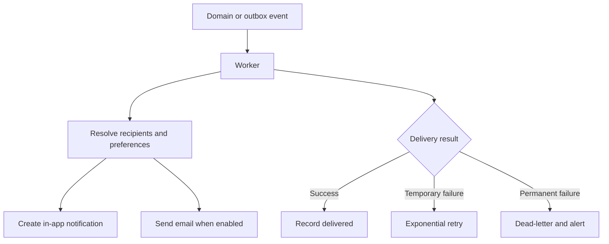

Jobs include deadline reminders, overdue alerts, report generation, expired invitation cleanup, and upload quarantine cleanup. Jobs must be idempotent.

## 19. Analytics and compliance semantics

Dashboards are derived projections, never alternative sources of truth. Use indexed SQL initially; run expensive reports asynchronously from consistent snapshots.

```text
Evidence coverage = accepted mandatory evidence slots / total mandatory evidence slots
Approval completion = completed required stages / total required stages
On-time verification = tasks verified by due date / tasks due in period
Compliance score = weighted evidence coverage
                   + weighted approval completion
                   + weighted on-time verification
                   - unresolved exception penalty
```

Always show the formula, weights, period, exclusions, penalty inputs, and last-computed time.

## 20. Production deployment on AWS EC2

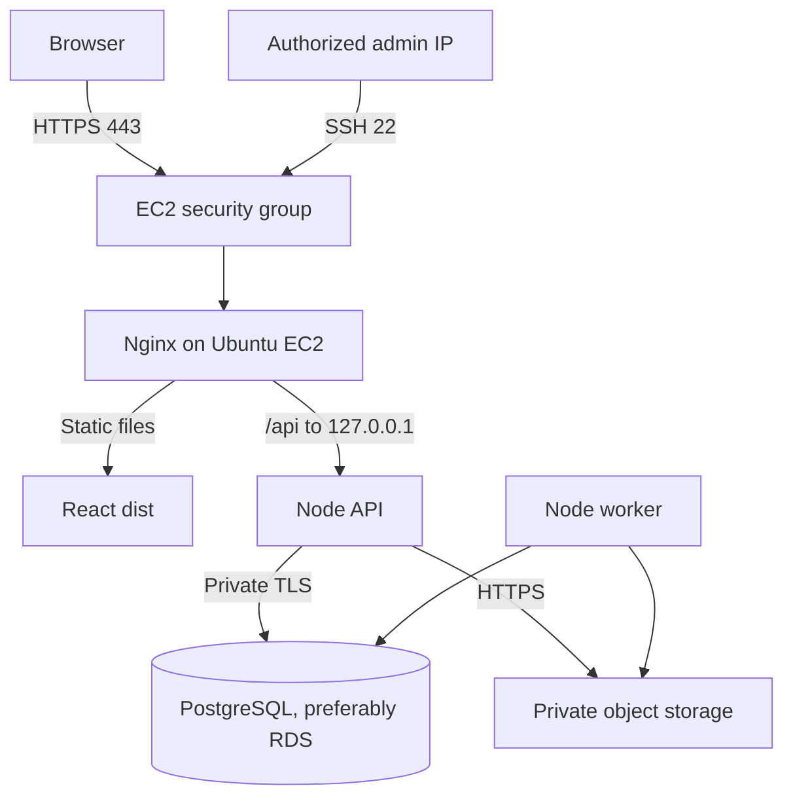

Only ports 80/443 should be public. SSH is restricted to the authorized IP. The API listens on loopback and the database is private.

Nginx should terminate TLS, redirect HTTP, serve cached assets, avoid long caching for `index.html`, support React Router fallback, proxy `/api`, forward proxy headers/request IDs, enforce limits/timeouts, and support WebSocket headers only if realtime is enabled.

Use versioned releases and systemd-managed `proofflow-api` and `proofflow-worker` processes. Prefer expand-and-contract migrations for rollback safety.

## 21. Configuration and secrets

Environment configuration belongs outside source control. Business rules belong in the database.

Typical settings include `NODE_ENV`, `PORT`, `APP_ORIGIN`, `DATABASE_URL`, access/refresh-token secrets, object-storage settings, email settings, and `LOG_LEVEL`.

Use IAM roles instead of long-lived AWS keys where possible. Store secrets in protected environment files, Parameter Store, or Secrets Manager. Commit only a redacted `.env.example`.

## 22. Reliability, recovery, and observability

Health model:

- `/health/live`: process event loop is responsive.
- `/health/ready`: required dependencies are reachable.
- Worker heartbeat: latest successful job claim/processing time.

Use structured JSON logs with timestamps, levels, service, request ID, safe tenant/actor context, route, status, duration, and error code. Never log passwords, tokens, cookies, private evidence URLs, or sensitive document contents.

Monitor API latency/errors, database health, upload failures, outbox age, worker retries/dead letters, review queue age, notification failures, resource usage, certificate expiry, and instance availability.

Use automated database backups, point-in-time recovery where available, object-storage versioning, encryption at rest and in transit, tested restoration, and explicitly approved RTO/RPO targets.

## 23. Scaling path

Scale from measurements rather than fashion:

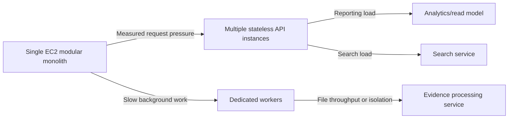

Initial state: one host, RDS if possible, S3, database-backed jobs, and indexed SQL analytics. Later options include a load balancer, independent workers, managed queues/Redis, read replicas, analytics stores, search, CDN, and dedicated evidence processing.

The arrows are evidence-based extraction triggers, not a predetermined march toward microservices.

## 24. Testing strategy

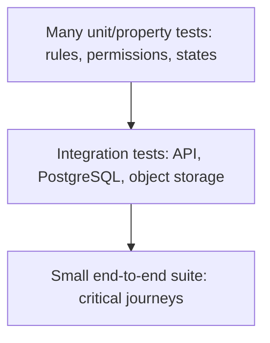

Test state transitions, tenant isolation, resource scope, separation of duties, deterministic rule evaluation and snapshots, evidence counts, revisions, rejection/resubmission, concurrency, audit/outbox atomicity, worker idempotency, authentication rotation, upload validation, budgets, compliance formulas, and Nginx routing.

Use real PostgreSQL for repository and transaction tests; SQLite is not an adequate substitute.

## 25. Recommended monorepo structure

```text
proofflow/
  apps/
    web/
      src/app/          # router, providers, shell
      src/features/     # projects, tasks, evidence, reviews, rules
      src/components/   # shared UI
      src/lib/          # API client and utilities
    api/
      src/modules/      # auth, organizations, projects, tasks, evidence...
      src/platform/     # database, storage, email, logging, jobs
      src/http/         # Express composition, middleware, errors
      src/worker/       # outbox and scheduled jobs
      prisma/
  packages/
    contracts/          # browser-safe schemas and types
    config/             # shared tooling configuration
    ui/                 # optional design system
  infra/                # nginx, systemd, scripts
  docs/                 # architecture and ADRs
```

Shared packages need a precise purpose. Never leak database models or server secrets into the web bundle.

## 26. Delivery roadmap

| Phase | Scope | Exit condition |
| --- | --- | --- |
| 1. Trustworthy task foundation | Auth, organizations, projects, tasks, RBAC, audit, deployment | Two organizations operate without data leakage |
| 2. Proof workflow | Uploads, requirements, revisions, reviews, rejection, resubmission, verification | Assigned-to-verified journey is defensible from audit history |
| 3. Operating controls | Notifications, deadlines, comments, expenses, budgets, worker, dashboards | Teams can operate daily and see bottlenecks and financial evidence |
| 4. Policy and assurance | Versioned rules, staged approvals, exceptions, scores, reports | Organization can express, explain, and export policy evaluation |
| 5. Hardening and scale | SSO, scanning, realtime if useful, restore drills, monitoring, horizontal scale | Improvements are driven by production risk and measurements |

## 27. Key architecture decisions

| Decision | Choice | Why |
| --- | --- | --- |
| Application shape | Modular monolith | Preserves transactions and keeps EC2 manageable |
| Database | PostgreSQL | Constraints, transactions, relations, indexes, JSON |
| ORM | Prisma | Type-safe schema/client and migrations |
| API | REST | Fits resource and workflow commands |
| Validation | Zod | Safe parsing at boundaries |
| File storage | Private S3-compatible storage | Durable bytes separated from relational metadata |
| Async consistency | Transactional outbox | Prevents database/notification dual-write loss |
| Rules | Versioned constrained JSON DSL | Deterministic, secure, explainable |
| Authentication | Short access tokens + rotating refresh sessions | Revocation and browser security |
| Deployment | Nginx + systemd on Ubuntu EC2 | Small, clear operational footprint |
| Tenancy | Shared database with mandatory organization scope | Simple initially; requires strict query authorization |

Create an ADR when a major decision changes or a significant dependency is introduced.

## 28. First-release non-goals

Do not turn ProofFlow into:

- a full accounting or ERP replacement;
- a general-purpose no-code programming language;
- a public anonymous evidence-sharing system;
- a blockchain project;
- premature microservices;
- an AI system that decides compliance without accountable humans;
- an arbitrary workflow builder that makes invariants impossible to understand.

These exclusions protect the core: credible proof, authorized review, reproducible policy, and usable audit history.

## 29. Open product decisions

Product ownership still needs to decide:

1. Whether tasks can have multiple contributors and who may submit for the group.
2. Which roles may review and when separation of duties is mandatory.
3. Whether review is bundle-level, item-level, or both.
4. When rule changes re-evaluate open tasks.
5. Evidence retention, deletion, and legal hold policies.
6. How task weight is determined for progress metrics.
7. Whether expenses integrate with an accounting system.
8. Compliance-score formulas and weights per organization.
9. Production RPO/RTO and evidence-availability commitments.
10. Which document types require malware scanning, OCR, or metadata extraction.

Until these are decided, preserve data and avoid irreversible assumptions.

## 30. Definition of architectural correctness

A feature is architecturally correct when it:

- represents a real business concept in domain language;
- enforces tenant, role, resource, and separation-of-duty authorization;
- changes state only through legal, tested transitions;
- preserves rule, evidence, submission, review, and actor history;
- commits business state, audit history, and asynchronous intent consistently;
- returns understandable API errors when invariants fail;
- can be operated, observed, backed up, restored, and secured; and
- adds distributed infrastructure only when measured need justifies it.

## Final mental model

Build ProofFlow as a tenant-isolated, audit-first modular monolith. Every meaningful workflow command should atomically update business state, preserve immutable history, record the rule and evidence used, and emit retryable asynchronous consequences.
